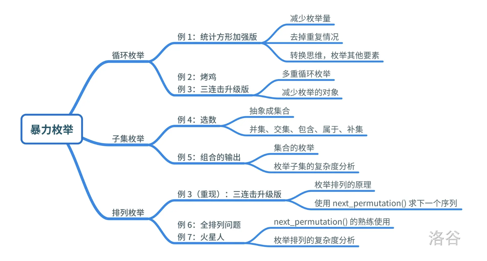
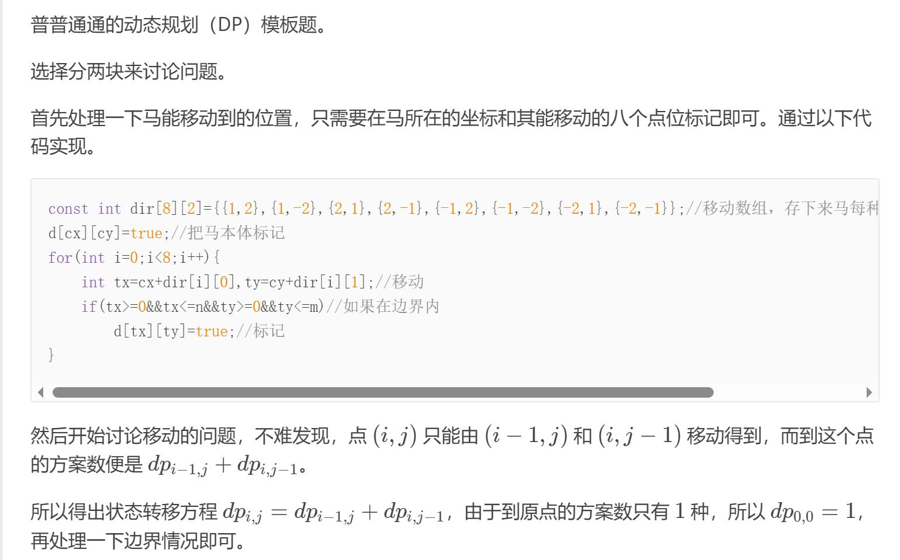

# 蓝桥杯
蓝桥杯学习及题目整理

## 基础知识
- 求绝对值：abs();
- 排序：sort();
- **高精度加法乘法**：`int digit = '0' - '0'; // 这里 digit 的值将会是 0`,在这段代码中，字符 '0' 被用于将数字字符转换为相应的整数值。例如，如果一个字符变量 ch 中存储了字符 '5'，我们可以使用 ch - '0' 来获取整数值 5。这是因为在 ASCII 编码中，数字字符 '0' 到 '9' 是连续的，其值分别对应整数 0 到 9。因此，通过减去字符 '0' 的 ASCII 值，我们可以得到相应的整数值。在**高精度加法**中，我们需要将字符型的数字 '0' 到 '9' 转换为相应的整数值，以便进行数字的加法运算。
- 判断是否是素数：
  ```c++
  bool IsPrime(int n)
	{
		if(n <= 1){
			return false;
		}
    	for (int i = 2; i <sqrt(n); i++)
    	{
        	if ((n % i) == 0){
        	    return false;
        	}
    	}
   	 	return true;
	}
  ```
## 算法
### 1 排序
#### 1.1 STL sort 函数的使用:
- 我们设我们排序的数组为 $a$，排序区间为$[l,r)$，且从小到大排序。则调用方法为`sort(a + l, a + r)`;
- 如果我们不想从小到大排序，而是想从大到小排序呢？那么我们就应该写一个比较函数（一般命名为`cmp`）来改变排序方法。
- 例如我们想要把一个类型为 int 的数组从大到小排序，我们应该这么定义这个**比较函数**：
  ```c++
  bool cmp(int a, int b){
	return a > b;
    }
  ```
- 写完这个函数，我们只需要在调用 sort 函数时在第三个参数写上函数名（例如 `sort(a + l, a + r, cmp)`;）就可以了。
- **结构体**也可以用它排序。
  ```c++
  struct node{
	int x, y;
    }c[1000];

  bool cmp(node a, node b){
	if(a.x != b.x){ // 如果两个 x 不等则以 x 的大小排序
	    return a.x > b.x;
	}
	return a.y > b.y; // 否则以 y 的大小排序
    }//在结构体排序中，必须创建比较函数或者重载运算符
  ```
- 在结构体排序中，必须创建**比较函数**或者**重载运算符**.
#### 1.2 快速排序
- 分治法
- 原理：递归是快速排序的主要思想，通过递归，我们将一个完整的序列经过不断的分解来变成很多个小序列，直到只有一个或没有数为止。这种排序就是在不断的递归和分解当中来慢慢实现与完成排序。
```c++
// 注：四个数组的下标均从 0 开始。
int randint(int l, int r){ // 生成在 [l, r] 之间的随机数
	return rand() % (r - l + 1) + l;
}
void qsort(int l, int r){ // l 为左端点，r 为右端点
	if(l >= r){ // 如果长度为 0 就返回
		return;
	}
   // 给大家讲解一下为什么此时可以不用判长度为 1 的序列：
   // 因为序列中的这个数在添加的过程中会自动被分到 c 数组中去，而 c 在之后是不用排序的，相当于什么都没做，当然也可以在这里判一下长度为 1 的情况，直接 return 就可以了
	int num = randint(l, r), ind1 = 0, ind2 = 0, ind3 = 0; // 随机选择一个数，并定义三个作为下标的变量来记录长度、存放数据
	for(int i = l;i <= r;i++){ // 将 a 中的数分别分到 b, c, d（如上所述）
		if(a[i] < a[num]){
			b[ind1++] = a[i];
		}
		else if(a[i] == a[num]){
			c[ind2++] = a[i];
		}
		else{
			d[ind3++] = a[i];
		}
	}
	for(int i = 0;i < ind1;i++){ // 将 b, c, d 中的数重新放回 a
		a[i + l] = b[i];
	}
	for(int i = 0;i < ind2;i++){
		a[i + ind1 + l] = c[i];
	}
	for(int i = 0;i < ind3;i++){
		a[i + ind1 + ind2 + l] = d[i];
	}
	qsort(l, l + ind1 - 1); // 继续排序原来的 b 和 d
	qsort(l + ind1 + ind2, r);
}
```
### 2 查找
#### 二分法
- 分治法
- 二分法是一种在有序数组中查找特定元素的算法。它通过将数组分成两半，并检查目标值是否在数组的中间，从而减少搜索的范围。如果目标值小于中间元素，则在数组的左半部分继续搜索；如果目标值大于中间元素，则在数组的右半部分继续搜索。这个过程会重复，直到找到目标值或确定它不在数组中。
#### nth_element
- nth_element(起始地址，查找元素的下标，最后一个元素地址+1，自定义排序(可省略))；
- 也可在结构体中使用：
  ```c++
    #include<iostream>
    #include<vector>
    #include<algorithm>//必要头文件 
    using namespace std;
    struct node{
	    int x,y;
    //	构造函数 
	    node(int x,int y){
		    this->x=x;
		    this->y=y;
	    }
    };
    bool cmp(node n1,node n2){
	    return n1.x<n2.x;
    }
    int main(){
	    vector<node> v;
	    node n1(1,3);
	    node n2(5,2);
	    node n3(3,6);
	    node n4(2,6);
	    node n5(4,4);
	    v.push_back(n1);
	    v.push_back(n2);
	    v.push_back(n3);
	    v.push_back(n4);
	    v.push_back(n5);
	    nth_element(v.begin(),v.begin()+1,v.end(),cmp);
    	cout<<"按x排序，第2小点的数是："<<endl;
    	cout<<"x:"<<v[1].x<<' '<<"y:"<<v[1].y;
    } 
  ```

### 3暴力枚举（数学思想）

#### DFS 深度优先搜索
##### 例题3.1 选数
```c++
void dfs(int m,int sum,int start){
	if(m==k){
		if(IsPrime(sum))ans++;
		return ;
	}
	for(int i=start;i<n;i++){
		dfs(m+1,sum+a[i],i+1);
	}
	return ;
}
```

#### 例题3.2 统计方形
- 算正方形的个数：
  - 如果我们固定了正方形的右下角(i,j),可以算出此时可能的正方形的个数为Min(i,j)
- 算长方形个数：
  - 固定矩形右下角(i,j),显然此时矩形个数为i*j，长方形个数即为矩形个数减去正方形个数。

#### next_permutation使用（暴力解法）

### 4递推与递归
#### 斐波那契数列
- **递归方法**
  ```c++
  #include<iostream> 
	#include<stdio.h>
	using namespace std;
	//Fibonacci数列递归解法 C++ 实现
	int Fib(int n) 
	{
		if(n==0) 
			return 0;
		else if(n==1)
			return 1;
		else
			return Fib(n-1)+Fib(n-2);
	}
	int main()
	{
		int n;
		cout<<"请输入一个数：";
		cout<<endl;
		cin>>n;
		cout<<Fib(n)<<endl;
		return 0;
	}
  ```
- 非递归方法
  ```c++
  #include<stdio.h> 
  #include<iostream>
	//Fibonacci数列非递归 C++ 实现 
	using namespace std;
 
	int fib(int n)
	{
		if(n==0)
			return 0;
		if(n==1)
			return 1;
		int f1=1;
		int f2=0;
		int fn=0;
		for(int i=2;i<=n;i++) 
		{
			fn=f2+f1;
			f2=f1;
			f1=fn;
		}
		return fn;
	}
 
	int main()
	{
	int n;
	cout<<"请输入一个整数：";		//表示要求的是数列中的第几个数。 
	cout<<endl; 
	cin>>n;
	cout<<fib(n)<<endl;
	return 0;
	}
  ```
#### 标数法
- 